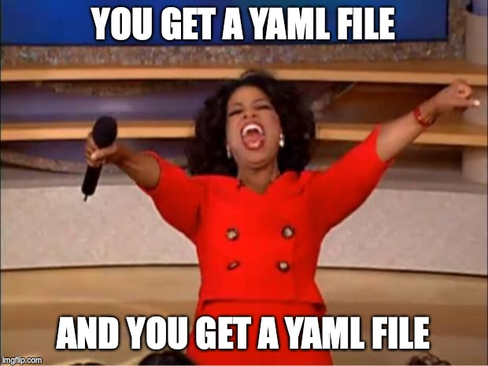

!SLIDE bullets

# DPK Configuration

To understand configuration in the DPK, you need to know two tools:

1. Hiera
1. Facter

!SLIDE bullets

# Hiera

Hiera is a key/value lookup tool for Puppet.

* Store configuration outside of code
* Store configuration in plain text files (`YAML` or `JSON`)
* Uses a "defaults, with overrides" pattern

!SLIDE bullets

# Facter

Facter is a system profiling library which discovers and reports per-node facts.

A fact can be:

* IP address
* Host name or FQDN
* OS version
* Custom value

!SLIDE bullets

# Hiera Hierarchy

The DPK delivers a hierarchy of configuration files:

1. `defaults.yaml`
1. `psft_customizations.yaml`
1. `psft_unix_system.yaml`
1. `psft_deployment.yaml`
1. `psft_configuration.yaml`
1. `psft_patches.yaml`

~~~SECTION:notes~~~

1. `defaults.yaml` contains the installation type (`fulltier` or `midtier`) and the current PeopleTools version
1. `psft_customizations.yaml` is where we can override any setting (except the values in `defauts.yaml`)
1. `psft_unix_system.yaml` is for unix system settings
1. `psft_deployment.yaml` is where installation locations are defined
1. `psft_configuration.yaml` is where domain configuration is defined
1. `psft_patches.yaml` is where you can specify patches for the DPK to apply (Linux only)

The only file we are supposed to edit is `psft_customizations.yaml`
~~~ENDSECTION~~~

!SLIDE bullets

# psft_customizations.yaml

The `psft_customizations.yaml` file is where customer settings go. A few rules to follow:

1. Spaces, not tabs (thats in the YAML spec)
1. Keep the hash structure/Copy the entire hash
1. Use `/` for paths, even with Windows
1. Use a good text editor
  1. Syntax highlighting
  1. Code folding

~~~SECTION:notes~~~
1. There is one exception to the `/` rule. On Windows, in the app server section where we define environment variables, you have to use `\\` for the path separator.
~~~ENDSECTION~~~

!SLIDE bullets

# DPK Sections

There are 6 main sections in the DPK configuration:

1. `tns_domain_list`/`mssql_server_list`
1. `appserver_domain_list`
1. `prcs_domain_lsit`
1. `pia_domain_list`
1. `component_preboot_setup_list`
1. `component_postboot_setup_list`

!SLIDE center subsection grey

# Demo

~~~SECTION:notes~~~
Let's look at a `psft_configuration.yaml` file to see the options.

Let's also talk about a few undocumented configuration options.

1. `config_settings:` and WLST for PIA domains (shown in `psft_customizations.yaml`)
1. `env_settings:`
~~~ENDSECTION~~~